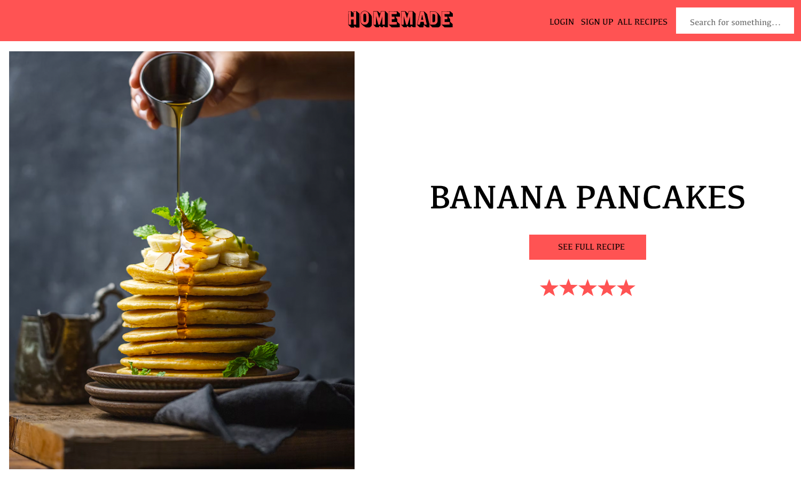
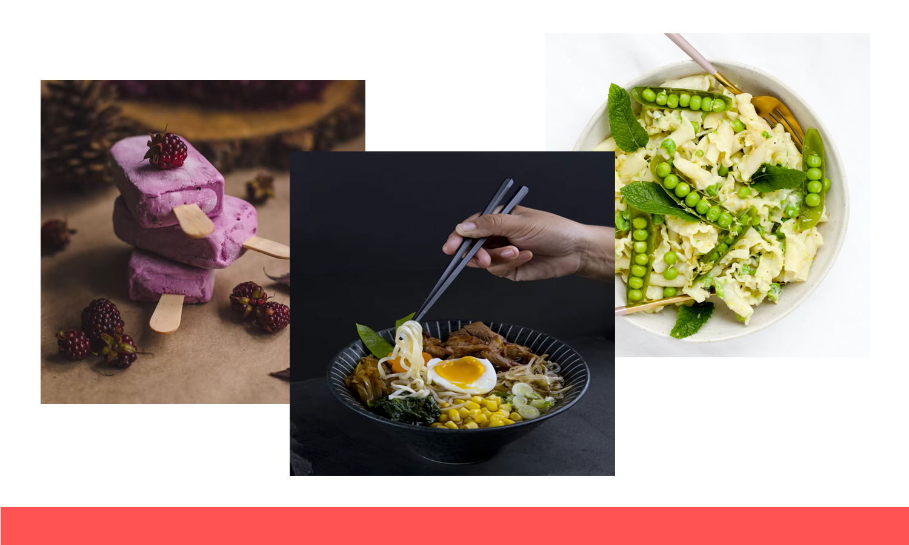
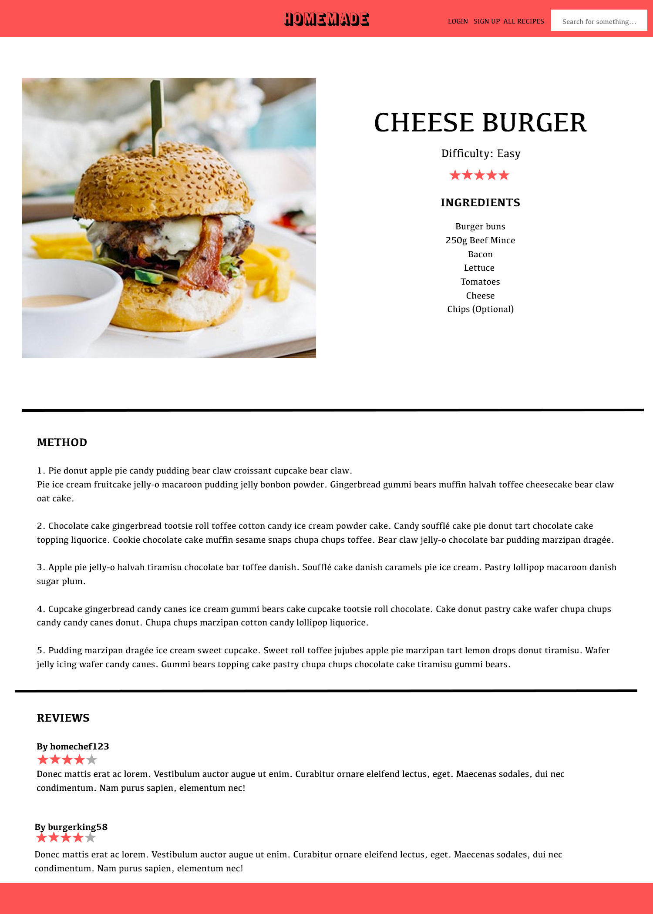
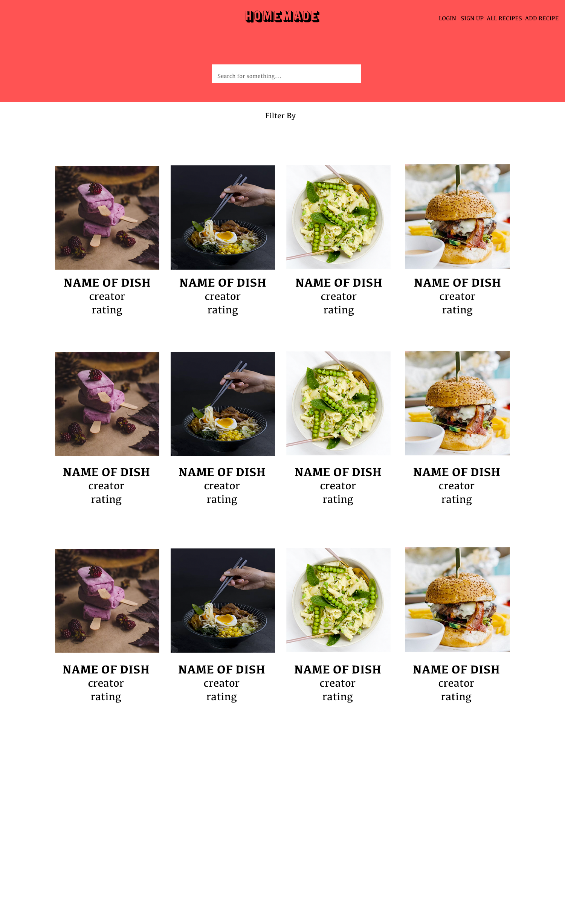

<h1 align="center">Welcome to </h1>
<div align="center">

</div>

## Overview
This was my third project on the Software Engineering Immersive course at General Assembly. It was a group project with Iury Liberato and Vez Maxwell.

## Timeframe
<p>9 Days</p>

## Goal
<p>To build a full-stack application, using an Express API to serve data from a Mongo database, consuming it with a separate front-end built with React. The application needed to have multiple relationships and CRUD functionality.</p>

### ❓ What is Homemade?
<p>Homemade is a recipe website application where users can view homemade recipes submitted by homemade members. The users can decide to register an account, which allows them to add, edit, and delete their own recipes, leave reviews, and customise their profiles.

## ✨ [Demo Homemade](https://recipes-homemade.herokuapp.com/)

<div align="center">

</div>

### 💾 Technologies Used
<li>HTML5</li>
<li>CSS3</li>
<li>SASS</li>
<li>JavaScript ES6</li>
<li>React</li>
<li>Insomnia</li>
<li>Git</li>
<li>GitHub</li>
<li>Chrome dev tools</li>
<li>MongoDB</li>
<li>Mongoose</li>

## 🚀 Approach

<h4>Day 1</h4>
This was our planning day. Iury came up with the idea of a recipe site quickly, so we started by looking at other recipe sites for inspiration. We had a main site we used for referencing (bonappetit.com/search). We all planned out what different pages/routes we wanted to have and a general website flow.
Vez then made some photoshop mockups for the site, which we all added our ideas into.

We decided to split up the work between the three of us so we could work independently and complete the app in time. I was tasked with completing the Individual recipe page, create and edit recipe pages, and profile, create and edit profile pages.

<div align="center">




</div>


<h4>Day 2/3</h4>
We decided to work with a shared screen in order to build the back-end using Express JS and MongoDB and to ensure exactly what we need to be inputted is there for the front-end. This included making the recipe and review schemas with a few seeded recipes so that we had some content to work with whilst building the front-end.

```
const reviewSchema = new mongoose.Schema({
  owner: { type: mongoose.Schema.ObjectId, ref: 'User', required: true },
  text: { type: String, maxlength: 400 },
  rating: { type: Number, min: 1, max: 5, required: true },
  image: { type: String }
}, {
  timestamps: true
})

const recipeSchema = new mongoose.Schema({
  name: { type: String, required: false, unique: true },
  summary: { type: String, maxlength: 500 },
  vegan: { type: Boolean, required: true },
  vegetarian: { type: Boolean, required: true },
  ingredients: [{ type: String, required: true }],
  time: { type: Number, required: true },
  image: { type: String, required: true },
  cuisine: { type: String, required: true },
  method: [{ type: String, required: true }],
  difficulty: { type: String, required: true },
  serves: { type: Number },
  owner: { type: mongoose.Schema.ObjectId, ref: 'User' },
  reviews: [reviewSchema]
})

const userSchema = new mongoose.Schema({
  username: { type: String, required: true, unique: true, maxlength: 30 },
  email: { type: String, required: true, unique: true },
  password: { type: String, required: true },
  profileImage: { type: String }
})
```

<h4>Day 4</h4>
We began to build the front-end using React JS. We started by planning out the main components we were going to need: nav-bar, login, sign-up, footer, home, auth, image upload, profile, profile-edit, recipe-edit, recipe-new, search-recipe, single-recipe, review-edit, review-new, stars, user-profile.
We started by focusing on nav-bar, register, login, and homepage.

<div align="center">

</div>


<h4>Day 5</h4>
Day 5 we created virtual fields for the average ratings, map methods for the reviews and filter methods for all recipes. We made the nav-bar functional and connected the built components to the links and added a carousel for the homepage.

```
recipeSchema.virtual('averageRating')
  .get(function () {
    if (!this.reviews.length) return 'Not yet rated'
    const sum = this.reviews.reduce((acc, review) => {
      return acc + review.rating
    }, 0)
    return Number(sum / this.reviews.length).toFixed(2)
  })

recipeSchema.set('toJSON', { virtuals: true })
```

<h4>Day 6</h4>
On day 6 authentication and the secure route were worked on. Login, signup and review components were connected with this. The add reviews section was also added to the bottom of each recipe page. The nav-bar was also made to change when somebody logins so they could see logout and create recipes.
The star rating system was added so you could see what the average star ratings for each recipe were.

<div align="center">

</div>

<h4>Day 7</h4>
We started by designing the all recipes page together by screen sharing photoshop. Then focused on searching for all recipes using the filter method. The login and signup were now given functionality. New forms were added for creating recipes and adding reviews following the same format as the other forms.
Later in the day we screen shared to begin making the website responsive.

<div align="center">

</div>

<h4>Day 8</h4>
<li>Add review finished</li>
<li>Load more added.</li>
<li>Login and sign up errors.</li>
<li>General css and finding better photos.</li>
<li>Finished making responsive</li>
<li>The add review component was completed.</li> 
<li>The load more function was added so that the all recipes page doesn't display an endless stream of recipes.</li> 
<li>Login and signup errors were added.</li>
<li>General css was tidied up and added in, better quality photos were added in and we finished making it responsive.</li>

<h4>Day 9</h4>
On day 9 we added some final functionality. On each recipe page the recipe displayed the owner of the recipe which led to the owner's profile. We added a way for people to change their name and profile image. We added in some more seeds to fill out the site some more.

<div align="center">

</div>


## Challenges
<li>Initially coming up with an idea we would all like working on, it's not easy finding a middle ground between a group of people but we managed it</li>
<li>We ran into some issues with error handling for both login and registration but we managed to sort this out</li>
<li>Making all the additional features user friendly and not just cumbersome</li>
<li>Using Git initially as we worked on the front end separately and had to add our changes to for others to see; This didn't always go smoothly</li>

## Wins
<li>Overall the general aesthetic looking exactly like what we wanted and planned from day one bar some colours</li>
<li>Adding all the features in time and feeling like we did our best for the project</li>
<li>Working well as a team and constructively giving feedback on individual work done</li>

## Key Learnings
<li>Working with Git; Each of us working on individual features then pushing to development to test and then to the master branch.</li>
<li>Dividing work between a team and working efficiently to ensure we completed the app on time</li>

## Bugs
<li>No known bugs</li>


## Author

👤 **Jason Abimbola**

* Github: [@JoinSamBalboa](https://github.com/JoinSamBalboa)
* LinkedIn: [@JoinSamBalboa](https://linkedin.com/in/joinsambalboa)
* Portfolio: [@JoinSamBalboa](https://www.joinsambalboa.com)


